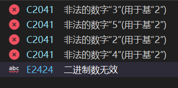
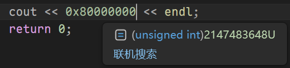
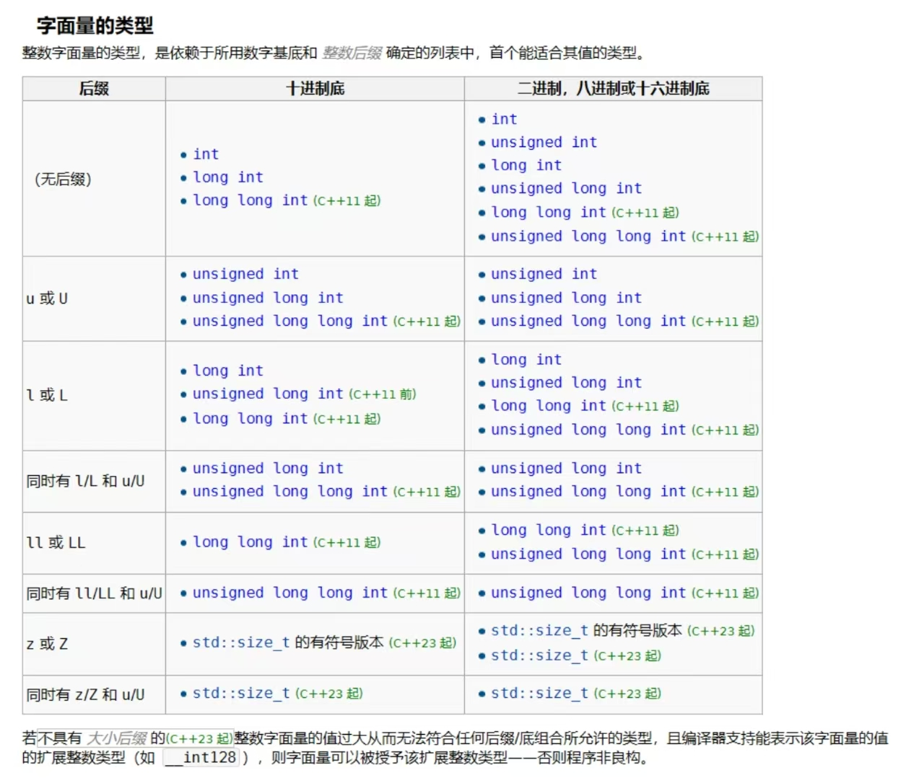

> 说明：
> 期末临近，我将之前这些以编号命名的笔记进行了重新整理


# 1.进制、数据类型、变量

## 进制
- 对于8进制和16进制转换，解决方法是：8进制转到2进制（每一位是3位2进制），然后转到16进制（每4位是一位16进制）   
## 数据类型
- 在当前的VS2026 debug/x64编译器标准配置下，`short`2字节，`int`4字节，`long`4字节，`long long`8字节，`char`1字节，`float`4字节，`double`8字节，`long double`8字节，这也将作为默认约定
### 整型
-  <mark style="background:#fff88f">计算机内的整数,正数用原码表示,负数用补码表示,该说法是否正确?</mark>
错的,只有一种表示补码,只不过正数的补码和原码一致,但是你绝对不能说正数用原码表示。
-  <mark style="background:#fff88f">现在看到一个以1开始的二进制整数(1 *** ), 应该是无符号的正数,还是有符号的负数?</mark>
错误的问题 !!!不是看到这个二进制整数后,再去判断该数是什么类型,而是要先确定以什么类型去看待这个数,再去确定该数的值 即:必须通过类型确定值,而不是通过值确定类型 !!!
#### 存储
- 模：指某种类型数据可以表示的不同数字的总数。比如char就是256.
- 补数：模减去数字本身就是补数。char的65,补数191.
- 计算机算减法可以表示成加法：A-B变成A+B的补数，再溢出截掉高位。
- 有符号采用补码存储，无符号采用原码存储。
- 补码的基本规则：正数和0正常，负数的话，原数字取绝对值，转二进制，取反，再+1
#### 数据类型细分
- `long`在一些编译器上并不是4字节，可能是8字节
- 虽然不同但都遵循这个规律：$\text{short}\leq \text{int}\leq \text{long} \leq \text{long long}$

#### 字面量
- 想要在 C++ 里表示一个整型常量，有这些方法：
	- 10 进制：直接写
	- 2 进制:0b+2 进制数（0b12345 会报错）
	
	- 8 进制：0+8 进制数
	- 16 进制：0x+16 进制数（0x/0X，a\~f/A\~F 均可）
- 但这上面都其实只是一个表示方法，最终在计算机里存的都是一样的 2 进制数字。
- 用 `typeid(123).name()` 可以查询到一个量存储使用的数据类型名。对于字面量，方便的查看方法：vs中移到字面量上方，即可显示字面量类型


- 普通一个整型数字，默认用 int 存，如果太长，改用 long long 存（显示为\_\_int64），再长，就存不了了，报错“常量太大”。
- 改变整数字面量的存储方式：可以在整型数据后面加 `L`（不建议小写，容易和 1 混淆）表示 long，LL 表示……，加 `U` 表示无符号类型。无法表示 short 类型。

### 浮点型 double float
#### 数据类型细分
- 课程使用MSVC和GCC双编译器的差别会在`long double`上体现：
  MSVCx86和x64都是8字节（就是上面这个），gcc 32bit是12字节，64bit是16字节
#### 字面量
- 想要在 C++ 里表示一个浮点型常量，只能用 10 进制表达.但是可以使用科学计数法：
123e5（表示的时候前面不是 1\~10 的数字是可以的）
12.3e6
1.23e7
……

#### 精度
float7位有效位数一定可以保证正确，double15位有效位数一定可以保证正确。课程统一取7和15这两个数。
#### 存储
单精度浮点数float占据4B内存，0位是符号位。1~8位共8位是指数，9~31共23位是尾数
双精度浮点数double占据8B内存，0位是符号位。1~11位共11位是指数，12~63共52位是尾数

下面以将float的<font color="#ff0000">0</font><font color="#ffc000">100 0010 1</font><font color="#00b050">100 1000 1000 0000 0000 0000</font>作为例子
**符号位**
0代表正数，1代表负数，本例中0是正数
**指数**
代表最终乘上的是2的几次方。为了能够表示负数指数，将127作为指数的基准，解读的时候需要减去127。比如本例的10000101是133,减127是6,也就是后面的数字是在$2^6$的基础上。
**尾数**
数字的有效位数的真正部分。隐藏了一个数位的1 ，而后面的，按照位次，第一个的权重是$2^{-1}$，第二个的权重是$2^{-2}$,以此类推。合起来就是有效数字部分，然后去乘2的指数次幂，就是最终的结果。或者你也可以这样理解：指数代表了这个数字最高位的二进制位数，这个位数默认为1，然后尾数按照之后的位数依次递减，$2^5,2^4,2^3,\dots$
**特殊保留**
在原有的解释上，有3个特殊的数字，不按照正常的解释逻辑解读。
- 0.指数、尾数所有位数全部都是0（符号位此时无意义），就是解读为0.
- inf.无穷大。指数全1,尾数全0.符号位代表正负，分别代表正无穷大和负无穷大。
- nan.not a number，非法数字。指数全1,尾数不全为0,符号位无意义。常见于一些实数集内无意义的运算，如被0除，负数开根。
- 浮点数默认采用 double 存储。同样，可以加 F 采用 float。
#### 转换
##### 二进制转十进制
本例的数字可以这样算：
10010001000000000000000对应$1 \times 2^6(\text{默认含有的1,不包含在尾数内}) + 1 \times 2^5 + 1 \times 2^2 + 1 \times 2^{-2}=64+32+4+0.25=100.25$
再加上符号位说明这个数字是正数
因此<font color="#000000">0</font><font color="#000000">100 0010 1</font><font color="#000000">100 1000 1000 0000 0000 0000</font>这个单精度浮点数，代表100.25
##### 十进制转二进制
首先确定正负，100.25是正数，第0位取0.
然后整数小数分开处理（其实本质是一样的，只是这样方便人手动操作）：
整数部分：100进行短除法求2进制，易得$(1100100)_2$
小数部分：不断乘2,不断取整数部分，和短除法是很像的
$0.25\times 2 = 0.5$整数部分是0,“余数”0.5
$0.5 \times 2 =1.0$整数部分是1,"余数"0,结束
所以，小数部分就是01000…
现在看最高位，$(1100100)_2$ 最高位位权$2^6$,所以指数是6，加上127,转成二进制就是10000101,作为指数部分，尾数部分，把刚才整数的二进制最高位1去掉，和小数部分的二进制拼在一起，100100010000……放到尾数部分去，最终组合为010000101100100010000……
##### 浮点数无法表示一些小数
依据这样的特性，我们会发现，有一些十进制下的小数(如0.2),无论怎么乘2,都不可能让小数部分为0,所以变成浮点数的过程是无穷无尽的，始终与真实数据有细微差别。

#### 银行家舍入法
四舍六入五成双。
IEEE754推荐的取整方法，目的是为了规避四舍五入在统计上偏大的缺陷。
现在已经确定要舍入到哪一位，那么这一位就是尾数位。
规则为：
1. 尾数≤4,舍去。
2. 尾数≥6,进1.
3. 尾数=5:
	1. 5后面有非0的内容，进1.
	2. 5后面全0：
		1. 5前面数是**奇数,进1**.
		2. 5前面数是**偶数,舍去**。

#### 第2周作业答案
> 总结
> 
> (1) float型数据的32bit是如何分段来表示一个单精度的浮点数的? 给出bit位的分段解释
> 
> 1bit符号位
> 8bit指数位
> 23bit尾数位
> 
>    尾数的正负如何表示? 尾数如何表示? 指数的正负如何表示? 指数如何表示?
> 符号位：0表示正数1表示负数
> 指数是移码，减127表示原数值，因此大于127是正指数，小于127是负指数
> 尾数：省略第一个1以后剩余的有效数字
> 
> 
> (2) 为什么float型数据只有7位十进制有效数字? 为什么最大只能是3.4x10^38 ?
> 因为float只有23位尾数，加上隐藏的首位1，总共可以最大表示到2^24 -1种情况。可以保证7位有效数字被精确表示。最大的时候，指数取到最大127（254-127=127255被保留用于表示inf）,剩余尾数全部取1,此时表示的数字大约为2*\2^127 ，大约就是3.4x10^38
> 有些资料上说有效位数是6~7位，能找出6位/7位不同的例子吗?
> 16777215,仍能精确表示第7位，此时有效尾数是7；
> 8.589975e9,不能精确表示第7位，最近的float数是8589974528
> 第7位从原来的5变成了4
> 
> (3) double型数据的64bit是如何分段来表示一个双精度的浮点数的? 给出bit位的分段解释
> 1bit符号位
> 11bit指数位
> 52bit尾数位
>    尾数的正负如何表示? 尾数如何表示? 指数的正负如何表示? 指数如何表示?
> 符号位：0表示正数1表示负数
> 指数是移码，减1023表示原数值，因此大于1023是正指数，小于1023是负指数
> 尾数：省略第一个1以后剩余的有效数字
> (4) 为什么double型数据只有15位十进制有效数字? 为什么最大只能是1.7x10308 ?
> 因为double有52位尾数，加上隐藏的首位1，总共可以最大表示到2^53 -1种情况。可以保证7位有效数字被精确表示。最大的时候，指数取到最大1023（2046-1023=1023,2047被保留用于表示inf）,剩余尾数全部取1,此时表示的数字大约为2\*2^1023 ，大约就是1.7x10^308
>    有些资料上说有效位数是15~16位，能找出15位/16位不同的例子吗?
>    16位:12345678901234567890,最近的double是12345678901234567168，第16位是6,没有变
>  15位:8.1234567890123569e100，最近的是8.123456789012357236493273971031228875262554643667075493e+100。第16位已经从原来的6变成了7
> (5) 8/11bit的指数的表示形式是2进制补码吗? 如果不是，一般称为什么方式表示?
> 不是。阶码或者叫移码
> 
> 
> "0舍1入"，实际的规则是"4舍6入5成双"，这是什么意思?
> 如果是4则舍去，如果是6则进1,和普通的规则相同
> 如果是5:如果5后面有非0数，比如1.251,则进1,变1.3；如果全是0看保留到的位数上是什么（即5前面那个数位）
> 1.如果是偶数，则舍去：1.25变成1.2
> 2.如果是奇数,则进1:1.15变成1.2
> 
### 字符型 char
- 字符常量可以用转义字符常量表示：
	- \\n        换行 对应一个换行符的 ASCII 码10
	- \\r        回车 对应一个换行符的 ASCII 码13
	- \\\\       \\符号本身
	- \\'       '符号本身
	- \\b      退格
	- \\"      "符号本身
	- \\t     制表符tab
	- \\开始最多 3 个数字        8 进制数对应 ASCII 码。加前导 0 补全 2 位或者 3 位都是可以的。
	- \\x+ 最多 2 个 16 进制位（2个是对于目前的学习而言）       16 进制对应 ASCII 码（a\~f/A\~F 均可。**但是不能\\X**！！！！！）
	- **不支持10进制**转义！

<div id="oct-char"></div>

- 关于8进制转义：\\开始最多 3 个数字
	- 如果你选择输入多个数字，编译器只会认前面的最多3个合法的数字，后面的当普通字符处理。
	- 如果编译器认到的这3个合法数字超出了377,那就报错，超出范围。
	- 如果你选择在\后直接跟 8、9 这种不合法的8进制数位，编译器不会报错，会报警告，说不认识这样的转义序列，然后放弃转义，未定义行为了。比如“\\888” 会解读为“888”。
- 关于16进制转义：\\x+ 最多 2 个 16 进制位（2个是对于目前的学习而言）
	- 如果你选择输入多个16进制位，编译器会全部读进去，但是会报错，超过范围（msvc）
	- 如果你选择\x后第一个就不是16进制位，编译器会认为这不是16进制的一部分，16进制数的长度是0,然后报错，说至少要有一个数
- 多字节放单引号：
	- 不要研究。
	- 汉字不是一个 char，是一个字符串。单引号括起来会告诉你这是一个 int，但是！单引号括汉字是一个错误方法，不要用。正确应该是双引号括起来。
- 字符型`char`其实要理解为1字节的整型，`char`是有`signed`和`unsigned`的
### 布尔值 bool
- bool类型C++原生，C没有的，加stdbool.h。
- bool类型只有0和1,但由于字节是最小单位，还是占据了1个字节。把同是1字节的char赋值给bool，还是会提示截断，说明两者规则并不相同，有数据丢失。

### 字符串常量
- 字符串常量：用双引号括起来。
- 可以连续搞一堆转义字符，编译器的阅读按照“最长原则”来进行。比如\\1234\\\\n 解读为【8 进制为 123 的字符】【字符‘4’】【字符‘\\’】【字符'n'】（但是\\x2fa 还是会报超范围的错，不会像 8 进制一样直接忽视）
- 字符串常量最后会有一个'\\0'代表字符串结束。所以实际存储起来会比字符串长度多一个字节。当然你用 `strlen()` 是不会把这个'\\0'算进去的。
### 字面量默认类型
字面量默认类型真正的规则很复杂，后续课程补充如下。
这表示从上到下依次适用。



## 变量
### 定义赋值使用
- C++ 标识符的命名规则：
	1. 由字母或下划线开头
	2. 由数字、字母、下划线组成
	3. 大小写敏感
	4. 长度 <=32,超过 32 位相同编译器会认为这是同一个标识符。这个行为不同的编译器不一样
	5. 标识符不能与已有关键字重复

- vs2026 里面可以用中文作为变量名，但是兼容性差（gcc 就报错），不允许使用
- auto 类型由变量初值自动决定变量类型，在涉及很复杂变量名的时候方便，但本课程禁用。

- `int a = b = c = 10;` 是一句错误的赋值
- `int c, b, a = b = c = 10;` 是一句正确的赋值：这体现了编译器思维，从左到右，见过就是有，没见过就是没有
- 
- 变量不赋初值在 vs2026 里报错，gcc 里警告，并使用不可预知的值（内存残留内容，没打扫）。
- 数据溢出在 C++ 里不当作是一种错误

- 常量的这个 const 先写后写无所谓
`const double pi = 3.14;` 和 `double const pi = 3.14;` 一样

### 数据类型不同变量互转
#### 同型有无符号整数互赋
机内二进制表示没有损失，一模一样，但由于两种编码不一样，表示的意义不一样。大概就是 long long 的 0 和正数部分那些数字互转没问题，但 long long 负数部分、unsigned long long 长出来那一部分是会互相转化的，产生意义的变化。其他的有无符号整型也是一样的道理。
相关代码理解：

```cpp
cout << 0x7FFFFFFFFFFFFFFF << endl;
//上面这个是long long的最大值，也可以用底下的代码表示
unsigned long long x = -1LL;
//首先，-1被转成了long long类型，要知道这是用补码表示的，就相当于所有数位都是1了，此时被赋值到unsigned long long里，二进制不变，就变成了2^64-1
cout << x / 2 << endl;//(2^64-1)/2是整除，得到2^63-1
```

#### 不同长度整型互转

- 强制类型转换3种方法：`(int)a`(C语言可用，其他都不行) `int(a)` `static_cast<int>(a)`结果上一样，实际上3种运作有区别，第3种最好。只读形式访问，临时转变。
- 赋值运算符左右类型不同，则将右值转成左值类型后赋值。
##### 短到长
一般都不会出问题，就是补位数就好了
有符号整数就补符号位，正数 0 补 0,负数补 1,能使得补码数值不变。
无符号整数就补 0.
但这里会发现一个问题，如果一个**有符号的短类型负数转到无符号的长类型**上，由于补的符号位是 1,前面全是 1,而无符号类型用的不是补码，多的 1 是把他当数值解读的，此时会导致数值突然膨胀。

##### 长到短
事故多发地，因为要舍弃部分数据了，此时编译器也会警告。(警告解决方法：强制类型转换)
采用的方法也很简单，高位不管多少，全部扔掉，低位不管怎么编码，都直接赋上去。

##### 浮点单双精度互转：
很显然不可能像整数那样暴力转，而是有对应的，指数对指数，尾数对尾数。float 到 double 里一定不会出现问题。但是 double 到 float，可能会报警告（C4305	“初始化”: 从“double”到“float”截断）。如果 double 的指数部分大过 float 的承载能力，可能出现显示为 inf 的情况，如果只是尾数大过 float 的承载能力，很简单，降低精度，裁掉后面的尾数。

- `float f = 1.2;`报：“初始化”: 从“double”到“float”截断。所以应该写`float f = 1.2f;`让一开始的字面量就是一个float。
 
##### 浮点整型互转
 - 浮点到整型的时候，直接舍去小数，并非四舍五入。
 - 整型到浮点的时候，整数精度不够补0；整数精度超出范围，要丢精度的时候，进行舍入。
##### char
- char 就是一个 1 字节整型，可以参与运算。
`int a = 'A'` 补齐了 24bit 的 0 的。
`char a = 65` 去了 24bit 的高位。


### 变量生存期、作用域和链接性

- 大括号内定义的变量只会在定义后，后括号前生效。
- 定义时分配内存，后括号结束释放内存。
- 并列的大括号可以定义名字相同的变量，实际上是不同的变量。
- 递归函数每一层都会新建局部变量，也只能被本层使用。
- 在所有大括号外面的是全局变量，在定义后，文件结束前全局生效，谁都可以用，也因此很危险，一般情况不建议用，课程一般情况下禁用全局变量。
- 对于嵌套（大括号里小的大括号）的时候定义同名的变量，会发生“低层屏蔽高层”，内层用内层定义的变量，和外层不是一个变量，外层不被内层这个同名变量所影响。这种内外层同名的情况要尽量避免。


#### 变量类型
- 应用程序运行时的内存分为3块：1.程序（代码）区、2.静态存储区、3.动态存储区
##### 局部变量
- 之前那些直接定义的正常的变量都是**自动变量**。不指定初始值，默认值是意外值。占用动态存储区。特征如之前所说，定义时申请内存，函数结束释放。函数的形参是一种自动变量，只是一定会被实参初始化。
- **静态局部变量**：`static int a = 1;`，占用静态存储区，在所在函数第一次被调用时申请内存并进行初始化（如果没有指定初始值,如`static int a;`，a的默认值为0）。退出函数的时候，不被释放，之后每一次调用函数，都忽略定义语句，借着用之前留下来的状态。这个局部变量依旧只能在函数内部使用，函数外部不可访问，但是依然存在。
- <font color="#7f7f7f">寄存器变量</font>：`register int a;`<font color="#7f7f7f">已废止(deprecated)。作用是把需要巨量访问的变量放到CPU寄存器里面去，提高运行速度，只对自动变量有效，不可长期占用。即使定义了，最终放不放进cpu寄存器去也要看编译器。</font>

##### 全局变量
全局变量都在静态存储区里面分配，没有初始化默认为0.
- **外部全局变量**：所有源程序文件中的函数均可以使用（当然要在作用范围里）
- `extern int a;`extern 用于拓展全局变量的作用范围，类似于变量的声明，声明了就可以在某个区域使用全局变量。多个源文件，必须要用extern来使用同一个外部全局变量。多个源文件是不可以拥有重复的同名外部全局变量的。
- extern的使用：全局变量是一个很危险的东西，有了extern就可以控制能够访问这个全局变量的函数。不推荐把`int a`和`extern int a`放在所有函数上面。应该在每个函数里面各自写`extern int a`，即使重复也要这样写。
- **静态全局变量**：`static int a;`仅限本源文件使用的变量。别的源程序extern不走的。这也是为什么可以有多个同名的静态全局变量（但一般是不建议重名的，只是假如真的重名了，静态全局变量可以保证互相不受到影响）。

##### 总结
- 静态存储区存的有：
	- 外部全局变量：最外面的`int a`
	- 静态全局变量：最外面的`static int a`
	- 静态局部变量：函数内的`static int a`
	- 常量/常变量：`const int a`
- 动态存储区存的有：
	- 自动变量：函数内的`int a`
	- 函数形参：调用函数时生成，`func(int a, int b)`
	- ~~堆~~
- CPU寄存区（上面都是在内存里）
	- 寄存器变量

| 变量类型   | 生存期（存在） | 作用域（访问） | 链接性（共享）  | 存储区    |
| ------ | ------- | ------- | -------- | ------ |
| 自动变量   | 本函数     | 本函数     | /        | 动态存储区  |
| 形参     | 本函数     | 本函数     | /        | 动态存储区  |
| 寄存器变量  | 本函数     | 本函数     | /        | CPU寄存器 |
| 静态局部变量 | 程序执行中   | 本函数     | /        | 静态存储区  |
| 静态全局变量 | 程序执行中   | 本源文件    | 一个源文件函数间 | 静态存储区  |
| 外部全局变量 | 程序执行中   | 所有源文件   | 多个源文件函数间 | 静态存储区  |
- 全局变量使用的原则
	1. 尽量不用
	2. 需要用，那就用静态全局变量
	3. 如果要源文件间共享，那也要在需要调用的函数里面用extern声明，不要整个上面声明
- 全局变量的命名
	- 下划线开头，可以选择下划线结尾，可以在开始部分加个自己的前缀作为区分
	- `_xx`


